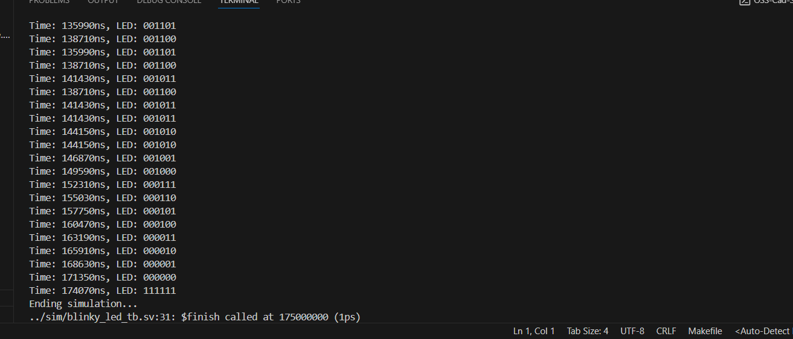
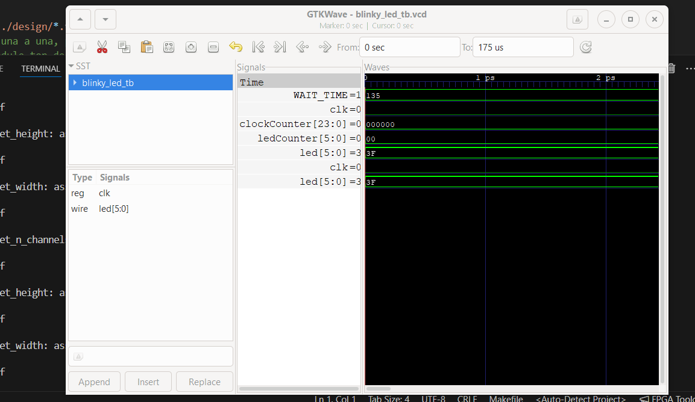
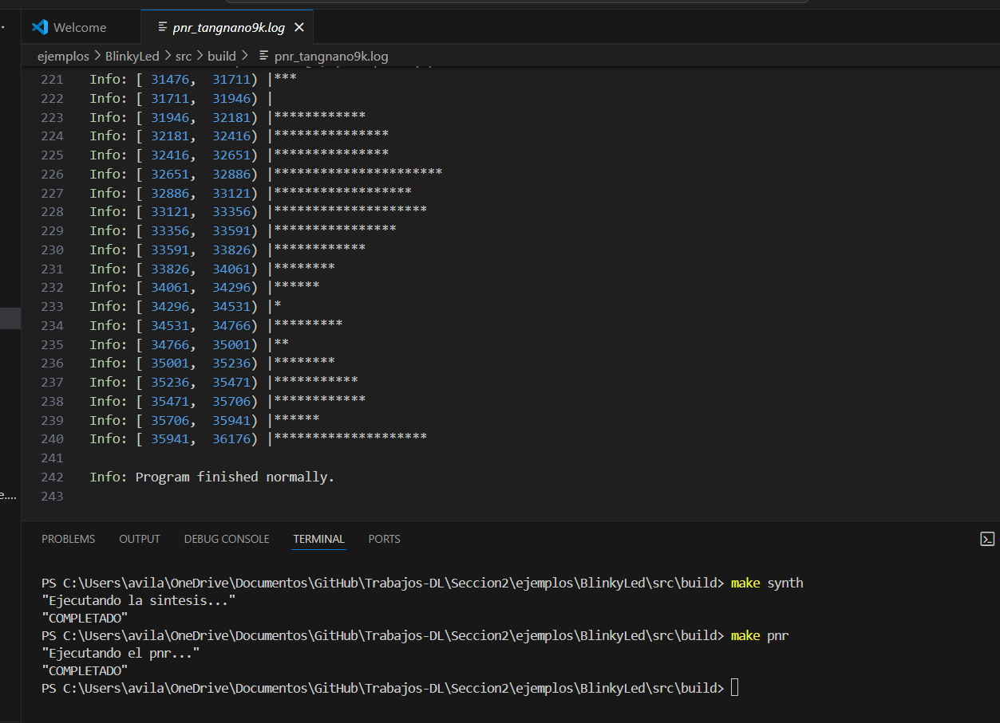

 Tutorial Seccion 2

## 1. Abreviaturas y definiciones
- **FPGA**: Field Programmable Gate Arrays

## 2. Referencias
[0] David Harris y Sarah Harris. *Digital Design and Computer Architecture. RISC-V Edition.* Morgan Kaufmann, 2022. ISBN: 978-0-12-820064-3

## Pruebas
Se realizó el "make test"

Se realizó el "make wn"

Se realizó el "make pnr"

Se realizó el "make bitstream"

Se realizó el "make all"

## 5. Problemas encontrados durante el proyecto
No se presentaron