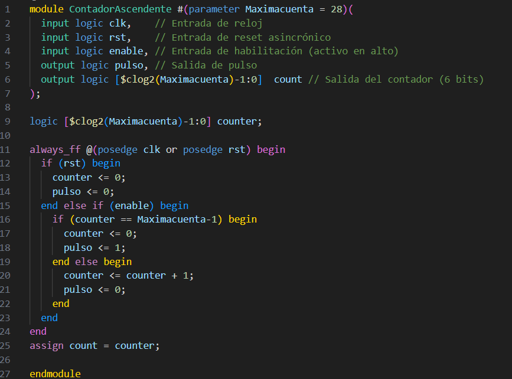
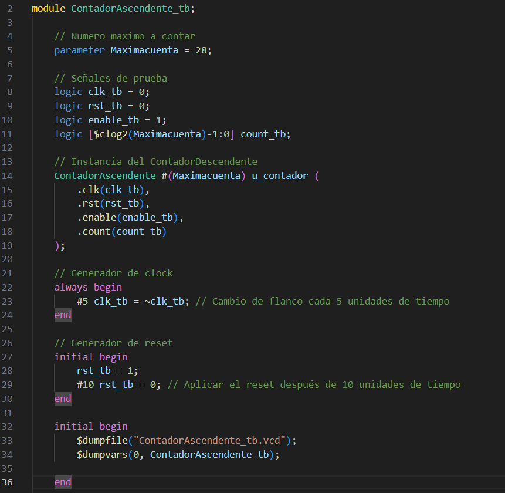
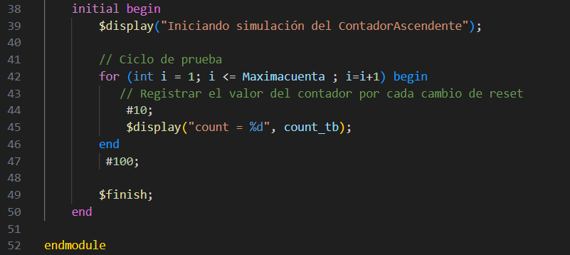

# Contador

Estudiante: Karina Quiros Avila-2021044233
Acontinuacion se presenta la solución de una tarea de puntos extra, la cual consiste en desarrollar un contador que llegue hasta 27. 

#### Modulos

### Testbench

## Pruebas
Se realizó el "make test"

## 5. Problemas encontrados durante el proyecto
No se presentaron